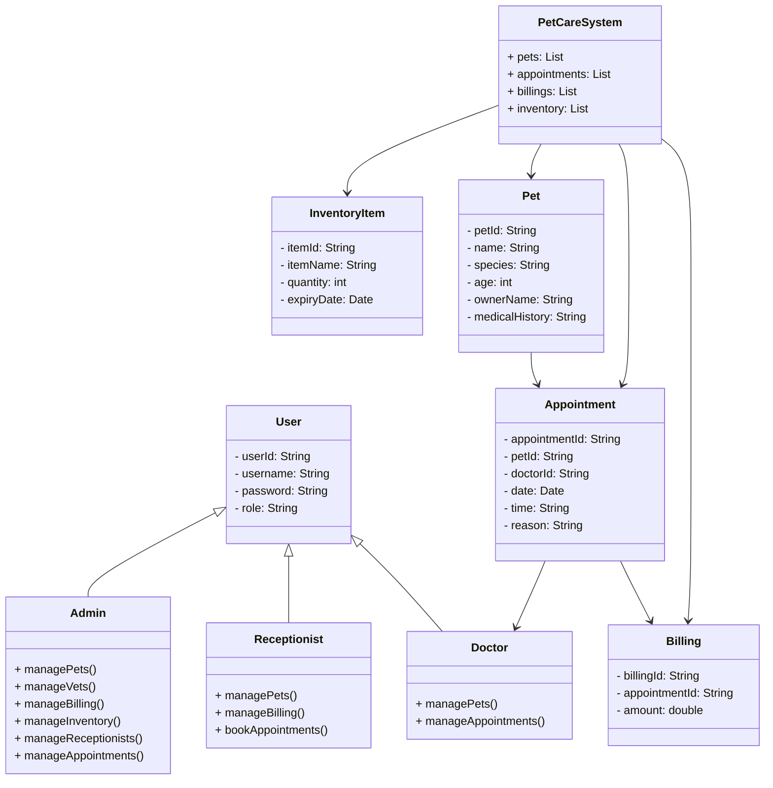

__Project Name:__ PetCare - Pet Boarding & Care Management System

__Problem Statement:__
Pet boarding centers often rely on manual or paper-based systems to manage daily operations like pet registration, appointment scheduling, billing, and inventory tracking. This can lead to disorganized records, missed appointments, and billing errors. Our project aims to solve this by developing a lightweight desktop application using Java and CSV file storage to streamline and digitize the entire process. The application will allow staff to register pets and owners, manage appointments with doctors, track medical inventory, and calculate billing automatically. By using Java Swing for the interface and CSV files for data handling, the system remains simple, portable, and easy to maintain without requiring a database setup

__UML Diagram__

 
__Object-Oriented Concepts:__
We will implement the following OOP concepts:
* __Encapsulation:__ Attributes are private, accessed through getter and setter methods
* __Abstraction:__ File I/O operations (CSV handling) are encapsulated in helper classes
* __Inheritance:__ Common attributes and methods for Admin, Receptionist, and Doctor extend from the User class
* __Polymorphism:__ Overloaded constructors or methods (e.g., display methods for different users)
* __Class and Object Use:__ For Pets, Users (Admin, Receptionist, Doctor), Appointments, Billing, Inventory, and the PetCareSystem
  
__Tech Stack:__
* __Programming Language:__ Java
* __UI Framework:__ Java Swing
* __Storage:__ CSV files (no database)
* __IDE:__ NetBeans
* __Version Control:__ GitHub
  
__Contributions:__
* __Sushma Kunjangada Arun:__ Login Screen, Admin Dashboard, and Admin Panels (Pets, Vets, Billing, Inventory, Receptionists, Appointments)
* __Ravikumar Gangenapura Suresh:__ Receptionist Dashboard, Doctor Dashboard, Pet and Appointment Management Panels
